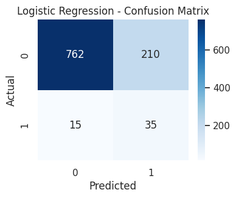
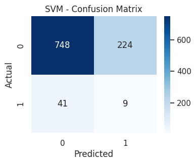
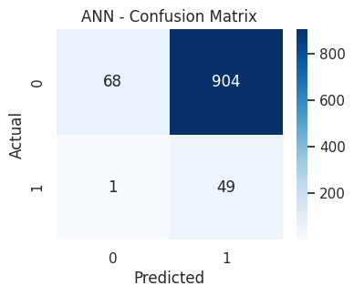
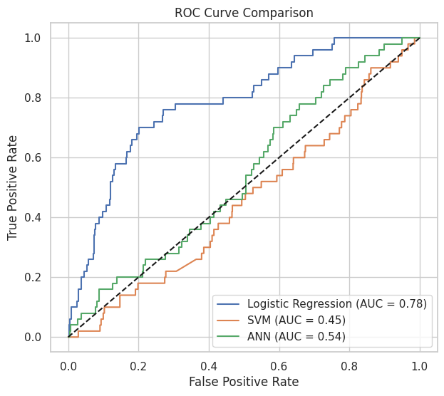
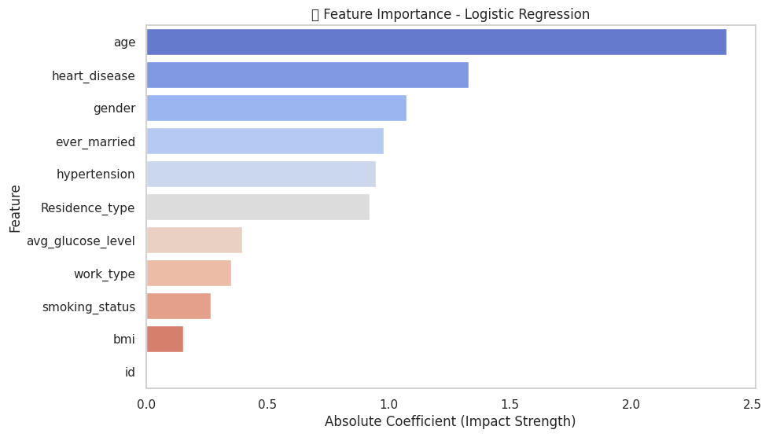

# Laporan Proyek Machine Learning - Yuda Reyvandra Herman

## Domain Proyek

Stroke atau penyakit serebrovaskular merupakan gangguan fungsi otak yang terjadi secara tiba-tiba akibat gangguan aliran darah ke otak, baik karena sumbatan (iskemik) maupun pecahnya pembuluh darah (hemoragik). Stroke menjadi salah satu penyebab utama kematian dan kecacatan jangka panjang di seluruh dunia. Berdasarkan laporan World Health Organization (WHO), sekitar 15 juta orang mengalami stroke setiap tahun, dan lebih dari 5 juta orang meninggal dunia, sementara jutaan lainnya mengalami kecacatan permanen yang mengubah kualitas hidup mereka secara drastis (WHO, 2023).

Di Indonesia, stroke menjadi penyebab kematian tertinggi menurut data dari Riskesdas (Riset Kesehatan Dasar) tahun 2018. Prevalensi stroke di Indonesia mencapai 10,9 per 1.000 penduduk, dengan faktor risiko utama seperti hipertensi, diabetes mellitus, merokok, obesitas, serta pola makan yang tidak sehat (Kementerian Kesehatan RI, 2018). Peningkatan usia harapan hidup dan perubahan gaya hidup masyarakat modern turut menyebabkan tren peningkatan kasus stroke dari tahun ke tahun.

Deteksi dini terhadap risiko stroke sangat penting dalam upaya pencegahan dan pengurangan dampak yang ditimbulkan. Pendekatan tradisional yang hanya mengandalkan pemeriksaan klinis kadang kala tidak cukup untuk mengidentifikasi risiko secara cepat dan tepat. Oleh karena itu, penggunaan teknologi berbasis data seperti machine learning menjadi solusi potensial dalam mengembangkan sistem prediktif yang mampu menganalisis berbagai faktor risiko secara komprehensif dan akurat.

\*\*Referensi

- World Health Organization. (2023). Stroke: Key facts. https://www.who.int/news-room/fact-sheets/detail/stroke
- Kementerian Kesehatan Republik Indonesia. (2018). Laporan nasional Riskesdas 2018. Badan Penelitian dan Pengembangan Kesehatan. https://www.litbang.kemkes.go.id/laporan-riset-kesehatan-dasar-riskesdas-2018/

## Business Understanding

Dalam dunia kesehatan, tantangan utama dalam penanganan stroke adalah deteksi dan pencegahan dini. Karena stroke bisa terjadi secara mendadak dan berdampak serius, identifikasi pasien berisiko tinggi secara cepat dan akurat sangat penting untuk menurunkan angka kematian dan kecacatan.

Masalah ini muncul dari kebutuhan tenaga medis untuk mengenali pasien berisiko tinggi berdasarkan data historis kesehatan. Pendekatan konvensional sering kurang efektif dalam menyaring risiko secara luas dan cepat.

Dengan memanfaatkan data seperti usia, tekanan darah, kadar glukosa, BMI, dan gaya hidup, dapat dibangun model prediktif berbasis data. Model ini diharapkan menjadi sistem peringatan dini yang mendukung pengambilan keputusan medis dan strategi pencegahan stroke.

### Problem Statements

- Bagaimana mengidentifikasi variabel-variabel yang paling berpengaruh terhadap risiko stroke pada pasien berdasarkan data historis kesehatan mereka?
- Bagaimana membangun model prediksi berbasis machine learning yang mampu mengklasifikasikan pasien berisiko tinggi dan rendah terhadap stroke?

### Goals

- Mengidentifikasi variabel paling berpengaruh terhadap risiko stroke.
  Dengan melakukan eksplorasi dan analisis data, proyek ini bertujuan menemukan faktor-faktor kunci seperti usia, hipertensi, kadar glukosa, dan status merokok yang paling memengaruhi kemungkinan seseorang terkena stroke.
- Membangun model prediksi stroke berbasis machine learning.
  Proyek ini bertujuan mengembangkan model klasifikasi yang akurat dan andal untuk memprediksi apakah seseorang berisiko mengalami stroke berdasarkan data kesehatan mereka.

### Solution statements

- Menerapkan dan membandingkan beberapa algoritma machine learning, seperti Logistic Regression, Support Vector Machine dan Artificial Intelligence
- Menggunakan feature importance untuk mengetahui fitur yang paling penting
- Masing-masing model akan dievaluasi menggunakan metrik seperti: Accuracy, Precision, Recall, F1-score, ROC-AUC

## Data Understanding

Dataset yang digunakan berjudul “Healthcare Dataset Stroke Data”, terdiri dari 5110 data pasien dengan berbagai informasi terkait faktor risiko stroke. Fitur-fitur yang tersedia mencakup usia, jenis kelamin, riwayat hipertensi, penyakit jantung, kadar glukosa, BMI, status merokok, jenis pekerjaan, dan label target stroke yang menunjukkan apakah pasien pernah mengalami stroke.

| Keterangan   | Detail                                                                                                      |
| ------------ | ----------------------------------------------------------------------------------------------------------- |
| Jumlah Data  | 5.110 baris                                                                                                 |
| Jumlah Fitur | 11 kolom                                                                                                    |
| Target       | `Stroke` (Yes / No)                                                                                         |
| Format       | CSV                                                                                                         |
| Sumber       | [Kaggle - Stroke Prediction Dataset](https://www.kaggle.com/datasets/fedesoriano/stroke-prediction-dataset) |

### Fitur

| **Fitur**         | **Keterangan**                                                            |
| ----------------- | ------------------------------------------------------------------------- |
| id                | Unique identifier buat semua orang                                        |
| gender            | 0 atau 1 (male or female)                                                 |
| age               | Umur                                                                      |
| hypertension      | 0 atau 1 (pernah atau tidak)                                              |
| heart_disease     | 0 atau 1 (pernah atau tidak)                                              |
| ever_married      | 0 atau 1 (pernah atau tidak)                                              |
| work_type         | Tipe pekerjaan (Private, self-employed, govt-job, children, never worked) |
| Residence_type    | Urban atau Rural                                                          |
| avg_glucose_level | Kadar glukosa                                                             |
| bmi               | Berat Badan                                                               |
| smoking_status    | Kategori perokok (formerly smoked, never smoked, smokes, unknown)         |
| stroke            | 0 atau 1 (ya atau tidak)                                                  |

### Exploratory Data Analysis
Gambar barchart dibawah menunjukkan distribusi target 'Stroke'

### Correlation Heatmap
Menampilkan korelasi antar fitur numerik dengan target 'Stroke'

- Usia ('age') menunjukkan korelasi positif tertinggi dengan stroke (0.25) dibandingkan fitur lain, menunjukkan bahwa semakin tua usia seseorang, semakin tinggi kemungkinan untuk mengalami stroke.

## Data Preparation

### Data Cleaning
- Menghapus kategori 'other' pada kolom 'gender', karena hanya ada 2 gender saja di dunia ini, yaitu laki-laki dan perempuan
- Mengisi missing value pada kolom 'bmi' menggunakan median

### Data Preprocessing
- Mengubah fitur kategorikal menjadi fitur numerikal menggunakan LabelEncoder
- Melakukan feature scaling pada fitur numerikal dengan metode standarisasi (z-score)
  
### Data Splitting
- Melakukan pemisahan data fitur (X) dan label (y)
- Membagi data latih dan data uji menjadi 8:2 

### Data Balancing 
- Menerapkan SMOTE untuk mem-balance data yang ada, karena data sebelumnya sangat imbalance sehingga model nantinya akan cenderung memprediksi kelas mayoritas
- SMOTE hanya untuk data training

## Modeling
Pada tahap Modeling, digunakan tiga algoritma: Logistic Regression, SVM, dan ANN, dengan data yang telah diseimbangkan menggunakan SMOTE untuk mengatasi ketimpangan kelas antara kasus stroke dan non-stroke.

### Tahapan dan Parameter Pemodelan
- Import library dan model dari sklearn, termasuk Logistic Regression, SVM, ANN, dan metrik evaluasi seperti accuracy, ROC AUC, classification report, dan confusion matrix.
- Definisikan model dalam dictionary models dengan parameter:
    - Logistic Regression pakai max_iter=1000 supaya training convergen.
    - SVM pakai probability=True supaya bisa output probabilitas.
    - ANN pakai hidden_layer_sizes=(32,16), max_iter=1000, dan random_state=42 untuk konfigurasi jaringan dan kestabilan training.
- Lakukan training model menggunakan data yang sudah di-balance dengan SMOTE (X_train_smote dan y_train_smote).
- Prediksi kelas dan probabilitas pada data uji (X_test) menggunakan model yang sudah dilatih.
- Hitung metrik evaluasi yaitu accuracy, ROC AUC (kalau tersedia), classification report (precision, recall, f1-score), dan confusion matrix.
- Simpan hasil evaluasi tiap model ke dalam dictionary results untuk memudahkan perbandingan performa.
- Cetak hasil metrik evaluasi agar mudah melihat performa masing-masing model.
  
### Logistic Regression
Kelebihan:
- Sederhana dan mudah diinterpretasi: Cocok untuk memahami hubungan antar variabel.
- Cepat dilatih: Komputasinya ringan, cocok untuk dataset kecil-menengah.
- Bekerja baik jika hubungan antar fitur dan target bersifat linier.
- Output probabilistik: Menghasilkan probabilitas prediksi, berguna untuk klasifikasi berbasis ambang batas (thresholding).

Kekurangan:
- Tidak cocok untuk hubungan non-linier (kecuali dimodifikasi dengan polynomial features).
- Sensitif terhadap outlier dan multikolinearitas.
- Kurang akurat dibanding model kompleks jika data sangat kompleks.

### Support Vector Machine 
Kelebihan:
- Akurasi tinggi terutama pada data yang kompleks dan berdimensi tinggi.
- Efektif pada data non-linier dengan penggunaan kernel (misalnya RBF, polynomial).
- Robust terhadap overfitting terutama pada dataset dengan fitur banyak dan jumlah data terbatas.

Kekurangan:
- Lambat pada dataset besar (scalability buruk).
- Pemilihan kernel dan tuning parameter seperti C dan gamma cukup rumit.
- Sulit diinterpretasi, tidak cocok untuk aplikasi yang memerlukan transparansi model.

### Artificial Neural Network
Kelebihan:
- Sangat fleksibel dan mampu menangkap hubungan non-linier yang kompleks.
- Mampu belajar dari data besar dengan banyak fitur.
- Bisa menghasilkan prediksi yang sangat akurat jika dilatih dengan benar.
  
Kekurangan:
- Butuh waktu dan sumber daya komputasi besar.
- Tuning hyperparameter (jumlah neuron, layer, learning rate, dll.) bisa rumit.
- Kurang interpretatif (dikenal sebagai "black-box model").

## Evaluation
| **Metrik**    | **Deskripsi**                                                                                                                                                                                                            |
| ------------- | ------------------------------------------------------------------------------------------------------------------------------------------------------------------------------------------------------------------------ |
| **Accuracy**  | Rasio prediksi yang benar dari seluruh prediksi. Pada kasus ini, Logistic Regression memberikan akurasi tertinggi (77.98%), artinya model ini paling banyak menghasilkan prediksi yang benar secara keseluruhan.         |
| **Precision** | Dari seluruh prediksi stroke, berapa yang benar-benar stroke. SVM dan ANN punya precision rendah untuk kelas stroke, menandakan banyak false positive. Logistic Regression sedikit lebih baik, tapi tetap belum optimal. |
| **Recall**    | Dari seluruh kasus stroke asli, berapa banyak yang berhasil dideteksi. Logistic Regression punya **recall tinggi (70%)**, artinya cukup bagus dalam mendeteksi kasus stroke walau dengan risiko false positive.          |
| **F1-Score**  | Rata-rata harmonis antara precision dan recall. Karena model Logistic Regression punya balance antara keduanya, F1-nya (24%) jadi yang paling mending dibanding dua model lain.                                          |

### Hasil evaluasi model 
| Model                   | Kelas | Accuracy | Precision | Recall | F1-Score |
| ----------------------- | ----- | -------- | --------- | ------ | -------- |
| **Logistic Regression** | 0     | 0.7798   | 0.98      | 0.78   | 0.87     |
|                         | 1     |          | 0.14      | 0.70   | 0.24     |
| **SVM**                 | 0     | 0.7407   | 0.95      | 0.77   | 0.85     |
|                         | 1     |          | 0.04      | 0.18   | 0.06     |
| **ANN**                 | 0     | 0.1145   | 0.99      | 0.07   | 0.13     |
|                         | 1     |          | 0.05      | 0.98   | 0.10     |

### Confussion Matrix
**Logistic Regression**

**Support Vector Machine**

**Artificial Neural Network**

### ROC Comparison

- Kurva ROC yang menampilkan trade-off antara true positive rate dan false positive rate, memberikan perspektif lebih lanjut terkait kemampuan deteksi positif dari setiap model. Visualisasi ini membantu mengidentifikasi model yang paling seimbang antara akurasi umum dan sensitivitas terhadap kelas minoritas.

### Feature Importance 
Gambar ini menampilkan fitur apa yang paling penting untuk model ini menggunakan **Logistic Regression**

- Berdasarkan hasil pada gambar, fitur yang paling berpengaruh terhadap kemungkinan stroke adalah usia (age) dengan koefisien paling besar positif, menandakan bahwa semakin tua seseorang, semakin tinggi risikonya

**Semua yang saya bahas diatas sudah sesuai dengan konteks data, problem statement, dan solusi yang diinginkan**
**Tambahan**
- Logistic regreession = Model ini menunjukkan performa yang paling seimbang. Dengan akurasi sebesar 77.98% dan skor ROC AUC sebesar 0.78, model ini mampu mendeteksi kelas minoritas (label 1) dengan recall yang cukup tinggi (0.70).
- Support Vector Machine (SVM) = SVM menghasilkan akurasi sebesar 74.07% namun menunjukkan performa yang buruk dalam mengenali kelas minoritas. Dengan recall hanya 0.18 untuk label 1 dan ROC AUC 0.45, model ini memiliki kecenderungan kuat untuk bias terhadap kelas mayoritas
- Artificial Neural Network = Model ANN menunjukkan performa yang sangat rendah dengan akurasi hanya sebesar 11.45%. Meskipun recall untuk kelas minoritas terlihat tinggi (0.98), hal ini disebabkan oleh model yang cenderung memprediksi sebagian besar data sebagai kelas positif, seperti terlihat dari confusion matrix-nya.

## Kesimpulan 
Berdasarkan keseluruhan proses analisis dan pemodelan yang telah dilakukan, Machine learning bisa membantu dalam mengidentifikasi pola risiko stroke dari berbagai data pasien, seperti data demografi, gaya hidup, dan kondisi kesehatan. Model-model yang umum dipakai, seperti Logistic Regression, Random Forest, atau SVM, bisa memberikan prediksi yang cukup akurat selama data yang digunakan lengkap dan sudah diproses dengan baik. Faktor-faktor utama yang memengaruhi risiko stroke biasanya meliputi tekanan darah tinggi, kadar kolesterol, usia, diabetes, dan kebiasaan merokok. Dengan adanya prediksi ini, dokter dan pasien dapat melakukan deteksi dini sehingga tindakan pencegahan bisa diambil sebelum stroke benar-benar terjadi, yang tentu saja sangat penting untuk menyelamatkan nyawa. Namun, tetap perlu diingat bahwa machine learning hanya alat bantu dan hasilnya harus dikombinasikan dengan evaluasi medis dari dokter sebelum mengambil keputusan akhir. Jadi, penggunaan machine learning dalam prediksi risiko stroke membuka peluang besar untuk meningkatkan efisiensi dan ketepatan dalam pencegahan stroke, yang menjanjikan masa depan kesehatan yang lebih baik.

