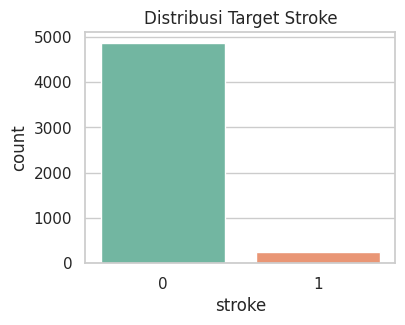
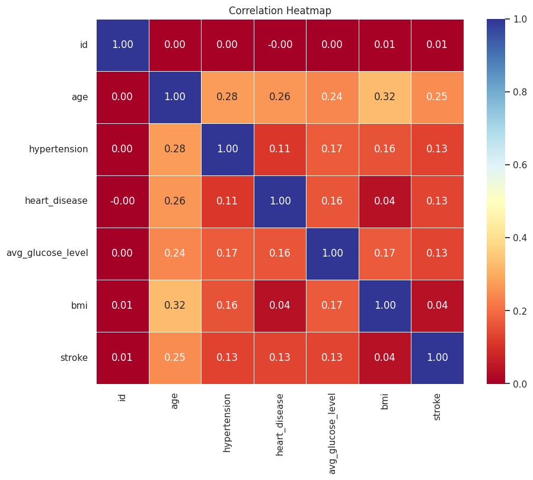

# Laporan Proyek Machine Learning - Yuda Reyvandra Herman

## Domain Proyek

Stroke atau penyakit serebrovaskular merupakan gangguan fungsi otak yang terjadi secara tiba-tiba akibat gangguan aliran darah ke otak, baik karena sumbatan (iskemik) maupun pecahnya pembuluh darah (hemoragik). Stroke menjadi salah satu penyebab utama kematian dan kecacatan jangka panjang di seluruh dunia. Berdasarkan laporan World Health Organization (WHO), sekitar 15 juta orang mengalami stroke setiap tahun, dan lebih dari 5 juta orang meninggal dunia, sementara jutaan lainnya mengalami kecacatan permanen yang mengubah kualitas hidup mereka secara drastis (WHO, 2023).

Di Indonesia, stroke menjadi penyebab kematian tertinggi menurut data dari Riskesdas (Riset Kesehatan Dasar) tahun 2018. Prevalensi stroke di Indonesia mencapai 10,9 per 1.000 penduduk, dengan faktor risiko utama seperti hipertensi, diabetes mellitus, merokok, obesitas, serta pola makan yang tidak sehat (Kementerian Kesehatan RI, 2018). Peningkatan usia harapan hidup dan perubahan gaya hidup masyarakat modern turut menyebabkan tren peningkatan kasus stroke dari tahun ke tahun.

Deteksi dini terhadap risiko stroke sangat penting dalam upaya pencegahan dan pengurangan dampak yang ditimbulkan. Pendekatan tradisional yang hanya mengandalkan pemeriksaan klinis kadang kala tidak cukup untuk mengidentifikasi risiko secara cepat dan tepat. Oleh karena itu, penggunaan teknologi berbasis data seperti machine learning menjadi solusi potensial dalam mengembangkan sistem prediktif yang mampu menganalisis berbagai faktor risiko secara komprehensif dan akurat.

\*\*Referensi

- World Health Organization (WHO). (2023). Stroke: Key facts. Retrieved from: https://www.who.int/news-room/fact-sheets/detail/stroke
- Kementerian Kesehatan Republik Indonesia. (2018). Laporan Nasional Riskesdas 2018. Badan Penelitian dan Pengembangan Kesehatan. Retrieved from: https://www.litbang.kemkes.go.id/laporan-riset-kesehatan-dasar-riskesdas-2018/

## Business Understanding

Dalam dunia kesehatan, tantangan utama dalam penanganan stroke adalah deteksi dan pencegahan dini. Karena stroke bisa terjadi secara mendadak dan berdampak serius, identifikasi pasien berisiko tinggi secara cepat dan akurat sangat penting untuk menurunkan angka kematian dan kecacatan.

Masalah ini muncul dari kebutuhan tenaga medis untuk mengenali pasien berisiko tinggi berdasarkan data historis kesehatan. Pendekatan konvensional sering kurang efektif dalam menyaring risiko secara luas dan cepat.

Dengan memanfaatkan data seperti usia, tekanan darah, kadar glukosa, BMI, dan gaya hidup, dapat dibangun model prediktif berbasis data. Model ini diharapkan menjadi sistem peringatan dini yang mendukung pengambilan keputusan medis dan strategi pencegahan stroke.

### Problem Statements

- Bagaimana mengidentifikasi variabel-variabel yang paling berpengaruh terhadap risiko stroke pada pasien berdasarkan data historis kesehatan mereka?
- Bagaimana membangun model prediksi berbasis machine learning yang mampu mengklasifikasikan pasien berisiko tinggi dan rendah terhadap stroke?
- Apakah sistem prediksi stroke yang dikembangkan dapat diintegrasikan ke dalam sistem informasi rumah sakit atau layanan kesehatan untuk mendukung pengambilan keputusan klinis?

### Goals

- Mengidentifikasi variabel paling berpengaruh terhadap risiko stroke.
  Dengan melakukan eksplorasi dan analisis data, proyek ini bertujuan menemukan faktor-faktor kunci seperti usia, hipertensi, kadar glukosa, dan status merokok yang paling memengaruhi kemungkinan seseorang terkena stroke.
- Membangun model prediksi stroke berbasis machine learning.
  Proyek ini bertujuan mengembangkan model klasifikasi yang akurat dan andal untuk memprediksi apakah seseorang berisiko mengalami stroke berdasarkan data kesehatan mereka.
- Menghasilkan sistem prediksi yang dapat diterapkan dalam praktik layanan kesehatan.
  Model yang dibangun diharapkan tidak hanya akurat, tetapi juga dapat diintegrasikan ke dalam sistem informasi rumah sakit atau aplikasi kesehatan untuk membantu pengambilan keputusan medis secara real-time.

Semua poin di atas harus diuraikan dengan jelas. Anda bebas menuliskan berapa pernyataan masalah dan juga goals yang diinginkan.

### Solution statements

- Menerapkan dan membandingkan beberapa algoritma machine learning, seperti Logistic Regression, Support Vector Machine dan Artificial Intelligence
- Menggunakan feature importance untuk mengetahui fitur yang paling penting
- Masing-masing model akan dievaluasi menggunakan metrik seperti: Accuracy, Precision, Recall, F1-score, ROC-AUC

## Data Understanding

Dataset yang digunakan berjudul “Healthcare Dataset Stroke Data”, terdiri dari 5110 data pasien dengan berbagai informasi terkait faktor risiko stroke. Fitur-fitur yang tersedia mencakup usia, jenis kelamin, riwayat hipertensi, penyakit jantung, kadar glukosa, BMI, status merokok, jenis pekerjaan, dan label target stroke yang menunjukkan apakah pasien pernah mengalami stroke.

| Keterangan   | Detail                                                                                                      |
| ------------ | ----------------------------------------------------------------------------------------------------------- |
| Jumlah Data  | 5.110 baris                                                                                                 |
| Jumlah Fitur | 11 kolom                                                                                                    |
| Target       | `Stroke` (Yes / No)                                                                                         |
| Format       | CSV                                                                                                         |
| Sumber       | [Kaggle - Stroke Prediction Dataset](https://www.kaggle.com/datasets/fedesoriano/stroke-prediction-dataset) |

### Fitur

| **Fitur**         | **Keterangan**                                                            |
| ----------------- | ------------------------------------------------------------------------- |
| id                | Unique identifier buat semua orang                                        |
| gender            | 0 atau 1 (male or female)                                                 |
| age               | Umur                                                                      |
| hypertension      | 0 atau 1 (pernah atau tidak)                                              |
| heart_disease     | 0 atau 1 (pernah atau tidak)                                              |
| ever_married      | 0 atau 1 (pernah atau tidak)                                              |
| work_type         | Tipe pekerjaan (Private, self-employed, govt-job, children, never worked) |
| Residence_type    | Urban atau Rural                                                          |
| avg_glucose_level | Kadar glukosa                                                             |
| bmi               | Berat Badan                                                               |
| smoking_status    | Kategori perokok (formerly smoked, never smoked, smokes, unknown)         |
| stroke            | 0 atau 1 (ya atau tidak)                                                  |

### Exploratory Data Analysis
Gambar barchart dibawah menunjukkan distribusi target 'Stroke'

### Correlation Heatmap

**Rubrik/Kriteria Tambahan (Opsional)**:

- Melakukan beberapa tahapan yang diperlukan untuk memahami data, contohnya teknik visualisasi data atau exploratory data analysis.

## Data Preparation

Pada bagian ini Anda menerapkan dan menyebutkan teknik data preparation yang dilakukan. Teknik yang digunakan pada notebook dan laporan harus berurutan.

**Rubrik/Kriteria Tambahan (Opsional)**:

- Menjelaskan proses data preparation yang dilakukan
- Menjelaskan alasan mengapa diperlukan tahapan data preparation tersebut.

## Modeling

Tahapan ini membahas mengenai model machine learning yang digunakan untuk menyelesaikan permasalahan. Anda perlu menjelaskan tahapan dan parameter yang digunakan pada proses pemodelan.

**Rubrik/Kriteria Tambahan (Opsional)**:

- Menjelaskan kelebihan dan kekurangan dari setiap algoritma yang digunakan.
- Jika menggunakan satu algoritma pada solution statement, lakukan proses improvement terhadap model dengan hyperparameter tuning. **Jelaskan proses improvement yang dilakukan**.
- Jika menggunakan dua atau lebih algoritma pada solution statement, maka pilih model terbaik sebagai solusi. **Jelaskan mengapa memilih model tersebut sebagai model terbaik**.

## Evaluation

Pada bagian ini anda perlu menyebutkan metrik evaluasi yang digunakan. Lalu anda perlu menjelaskan hasil proyek berdasarkan metrik evaluasi yang digunakan.

Sebagai contoh, Anda memiih kasus klasifikasi dan menggunakan metrik **akurasi, precision, recall, dan F1 score**. Jelaskan mengenai beberapa hal berikut:

- Penjelasan mengenai metrik yang digunakan
- Menjelaskan hasil proyek berdasarkan metrik evaluasi

Ingatlah, metrik evaluasi yang digunakan harus sesuai dengan konteks data, problem statement, dan solusi yang diinginkan.

**Rubrik/Kriteria Tambahan (Opsional)**:

- Menjelaskan formula metrik dan bagaimana metrik tersebut bekerja.

**---Ini adalah bagian akhir laporan---**

_Catatan:_

- _Anda dapat menambahkan gambar, kode, atau tabel ke dalam laporan jika diperlukan. Temukan caranya pada contoh dokumen markdown di situs editor [Dillinger](https://dillinger.io/), [Github Guides: Mastering markdown](https://guides.github.com/features/mastering-markdown/), atau sumber lain di internet. Semangat!_
- Jika terdapat penjelasan yang harus menyertakan code snippet, tuliskan dengan sewajarnya. Tidak perlu menuliskan keseluruhan kode project, cukup bagian yang ingin dijelaskan saja.
